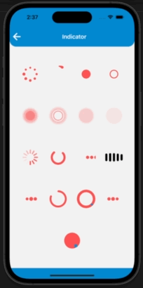

# react-native-skia-catalog

---

## [](https://www.android.com) [](https://developer.apple.com/ios) [](https://opensource.org/licenses/MIT)

<br>

This custom animated skia component library provides multiple custom animated skia components like `Indicator`, `StrikeImage`, `Notification`, `ThemeSwitch`, `SkiaLike`, `AnimatedWallet` and many more!

- It also provides an example app and a detailed usage overview of every available component.
- All the available components are fully Android and iOS compatible.
- See our available <a href="#Components">Components</a>.

## 🎬 Preview

| <div style="width:270px"></div>Indicator | <div style="width:270px"></div>StrikeImage  | <div style="width:270px"></div>Notification  | <div style="width:270px"></div>ThemeSwitch  |
| :--------------------------------------: | :-----------------------------------------: | :------------------------------------------: | :-----------------------------------------: |
|        |  |  |  |

| <div style = "width: 270px">SkiaLike</div> | <div style = "width: 270px">AnimatedWallet</div> | <div style = "width: 270px">AnimatedScanner</div> | <div style = "width: 270px">MediaButton</div> |
| :----------------------------------------: | :----------------------------------------------: | :-----------------------------------------------: | :-------------------------------------------: |
|    |    |    |           |

| <div style = "width: 270px">HeartRate</div> | <div style = "width: 270px">WirelessCharger</div> | <div style = "width: 270px">SkiaCharging</div> | <div style = "width: 270px">AnimatedCheckmark</div> |
| :-----------------------------------------: | :-----------------------------------------------: | :--------------------------------------------: | :-------------------------------------------------: |
|           |    |           |           |

---

## Installation

##### 1. Install skia catalog

```bash
$ npm install react-native-skia-catalog
# --- or ---
$ yarn add react-native-skia-catalog
```

##### 2. Install required dependencies

```bash
$ npm install @shopify/react-native-skia
# --- or ---
$ yarn add @shopify/react-native-skia
```

##### 3. Install cocoapods in the ios project

```bash
cd ios && pod install
```

## Components

---

### Ⅰ. [Indicator](./src/components/Indicator)

[More about Indicator component](./src/components/Indicator/README.md)

---

### ⅠI. [StrikeImage](./src/components/StrikeImage)

[More about StrikeImage component](./src/components/StrikeImage/README.md)

---

### ⅠII. [Notification](./src/components/Notification)

[More about Notification component](./src/components/Notification/README.md)

---

### IV. [ThemeSwitch](./src/components/ThemeSwitch)

[More about ThemeSwitch component](./src/components/ThemeSwitch/README.md)

---

### V. [SkiaLike](./src/components/SkiaLike)

[More about SkiaLike component](./src/components/SkiaLike/README.md)

---

### VI. [AnimatedWallet](./src/components/AnimatedWallet)

[More about AnimatedWallet component](./src/components/AnimatedWallet/README.md)

---

### VII. [AnimatedScanner](./src/components/AnimatedScanner)

[More about AnimatedScanner component](./src/components/AnimatedScanner/README.md)

---

### VIII. [MediaButton](./src/components/MediaButton)

[More about MediaButton component](./src/components/MediaButton//README.md)

---

### IX. [HeartRate](./src/components/HeartRate)

[More about HeartRate component](./src/components/HeartRate/README.md)

---

### X. [WirelessCharger](./src/components/WirelessCharger)

[More about WirelessCharger component](./src/components/WirelessCharger/README.md)

---

### XI. [AnimatedCheckMark](./src/components/AnimatedCheckMark)

[More about AnimatedCheckMark component](./src/components/AnimatedCheckMark/README.md)

---

### Example

A full working example project is here [Example](./example/).

```sh
$ yarn
$ yarn example ios   // For ios
$ yarn example android   // For Android
```

## Find this library useful? ❤️

Support it by joining [stargazers](https://github.com/SimformSolutionsPvtLtd/react-native-skia-catalog/stargazers) for this repository.⭐

## 🤝 How to Contribute

We'd love to have you improve this library or fix a problem 💪
Check out our [Contributing Guide](CONTRIBUTING.md) for ideas on contributing.

## Bugs / Feature requests / Feedbacks

For bugs, feature requests, and discussion please use [GitHub Issues](https://github.com/SimformSolutionsPvtLtd/react-native-skia-catalog/issues).

## Awesome Mobile Libraries

- Check out our other available [awesome mobile libraries](https://github.com/SimformSolutionsPvtLtd/Awesome-Mobile-Libraries).

### License

- [MIT License](./LICENSE)
